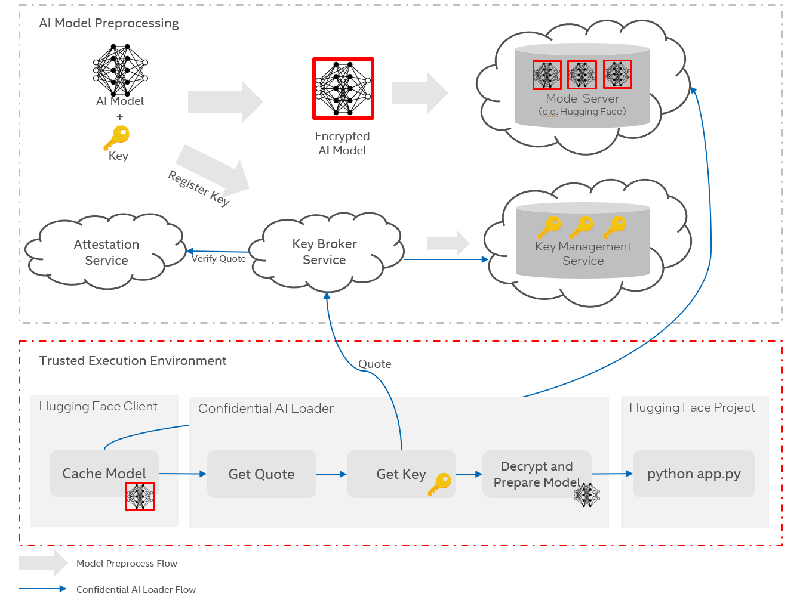
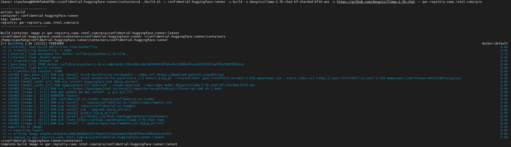
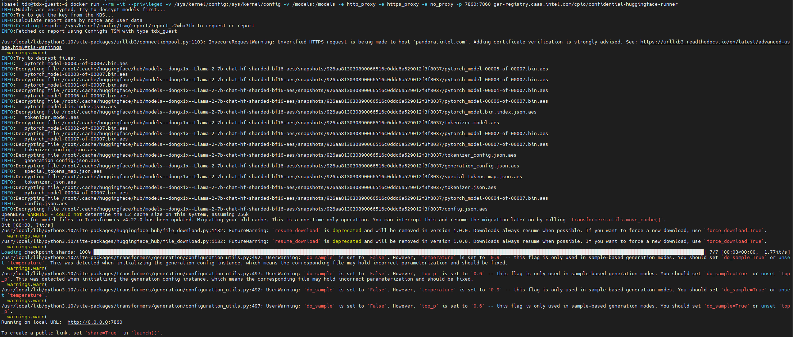

# Confidential Hugging Face Runner

This project is designed to build a runner to make the Hugging Face project easily running inside
Trusted Execution Environment (TEE), especially for Large Language Model (LLM), and demonstrate
whole process from evidence collection and attestation.

## Protect AI Models by Confidential AI Loader

Confidential AI loader is designed to prepare AI models before loading it to memory. There are two
major parts to protect the models in TEE:

* AI model encryption
* Decrypt model with attestation

### Arhitecture Overview


### AI Model Preprocessing

To protect the model and its encryption key, the following preprocessing steps are taken:

* Generate a key, a AES GCM key can be used for confidentiality and integrity.

    ```Shell
    # Generate a 256 bit (32 bytes) random key
    KEY=`head -c 32 /dev/random | base64`
    ```

* Encrypt AI model by the key.

    ```Shell
    # Install confidential ai loader
    cd container/confidential-huggingface-runner/confidential-ai-loader && pip install -e .
    # Encrypt models
    python crypto.py -i ${INPUT_DIR} -o ${OUTPUT_DIR} -k ${KEY}
    ```

* Upload the encrypted model to Model Server. For example, using Hugging Face model server:

    ```Shell
    # Clone the repo
    git clone git@hf.co:<your-username>/<your-model-name>
    cd <your-model-name>

    # Enable large files
    git lfs install
    huggingface-cli lfs-enable-largefiles .

    # Upload the models
    git add .
    git commit -m "First model version"  # You can choose any descriptive message
    git push
    ```

* Register key to Key Broker Service (KBS), and KBS will communicate with Key Management Service (KMS) to store the key in its database. For example, using Intel Trust Authority Key Broker Service:

    * Get access token

        ```Shell
        BODY='{"username":"'$USER'", "password":"'$PASS'"}'
        TOKEN=`curl -X POST $URL$API_TOKEN -d "$BODY" -H "Accept:application/jwt" \
            -H "Content-Type:application/json"`

        ```
    * Create a key transfer policy

        ```JSON
        {
            "attestation_type":"TDX",
            "tdx":{
            "attributes":{
                "enforce_tcb_upto_date":false,
                "mrseam":["5b38e33a6487958b72c3c12a938eaa5e3fd4510c51aeeab58c7d5ecee41d7c436489d6c8e4f92f160b7cad34207b00c1"],
                "mrsignerseam":["000000000000000000000000000000000000000000000000000000000000000000000000000000000000000000000000"],
                "seamsvn":6
            },
            "policy_ids": []
            }
        }
        ```

        ```Shell
        # Register policy
        RESP=`curl -X POST $URL$API_POLICY -d @scripts/amber_policy.json -H "Accept:application/json" \
        -H "Content-Type:application/json" -H "Authorization:Bearer $TOKEN"`
        POLICY_ID=`echo $RESP | jq -r .id`
        ```

    * Register key

        ```Shell
        BODY='{"key_information":{"algorithm":"AES","key_data":"'$KEY'","key_length":256},"transfer_policy_id":"'$POLICY_ID'"}'
        RESP=`curl -X POST $URL$API_KEYS -d $BODY -H "Accept:application/json" \
            -H "Content-Type:application/json" -H "Authorization:Bearer $TOKEN"`
        KEY_ID=`echo $RESP | jq -r .id`
        echo key id: $KEY_ID
        ```

### Build and Run

Confidential AI Loader, encrypted models and hugging face project can be built to one container,
then the project can be easily ran inside TEE.

* Build the container

```Shell
cd container
./build.sh -c confidential-huggingface-runner -a build -m dongx1x/Llama-2-7b-chat-hf-sharded-bf16-aes -p https://github.com/dongx1x/llama-2-7b-chat -r gar-registry.caas.intel.com/cpio
```
the example output:


* Run

```Shell
docker run --rm -it --privileged -v /sys/kernel/config:/sys/kernel/config -v /models:/models -e http_proxy -e https_proxy -e no_proxy -p 7860:7860 gar-registry.caas.intel.com/cpio/confidential-huggingface-runner
```

the example output:

